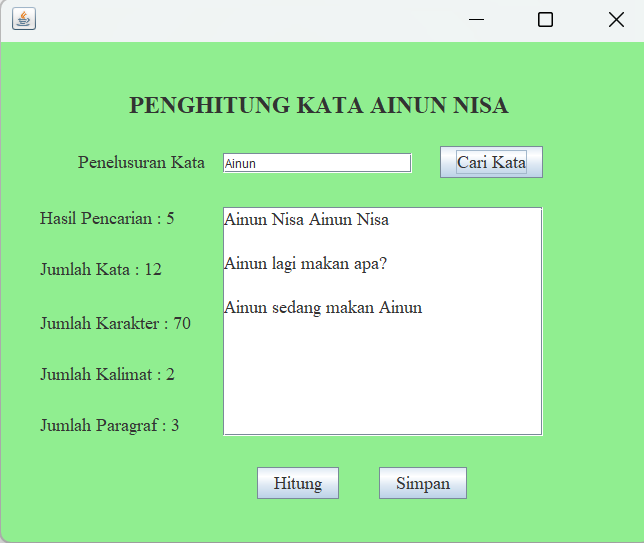

# AplikasiPenghitungKata
 Tugas 5 - Ainun Nisa - 2210010099

# Aplikasi Penghitung Kata
adalah untuk menghitung kata yang diketik

# Keunggulan Aplikasi
Penghitung Kata: Aplikasi ini memiliki penghitung kata, terdapat pencarian kata, jumlah karakter, jumlah kalimat, jumlah paragraf

# Pembuat Aplikasi
Ainun Nisa - 2210010099 - Tugas 5

# Fitur
Aplikasi ini menawarkan fitur:
Penghitungan kata Perhitungan karakter Perhitungan kalimat Perhitungan paragraf

# Cara Menjalankan
Run File
Ketikkan kata di text area
Tekan Button hitung, maka akan keluar hasil kata, karakter, kalimat, dan paragraf
Ketikkan kata tersebut di text field
Tekan Button cari kata, maka akan keluar hasil pencarian kata

# Demo

